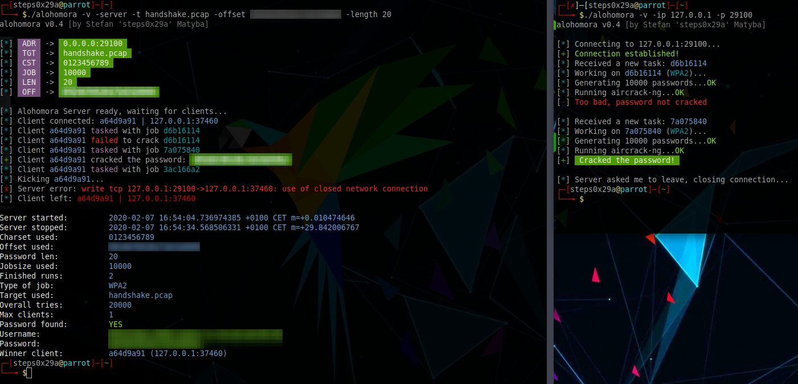

<h1 align="center">
  	alohomora
</h1>

    
    
        
    
    

# alohomora
alohomora is a distributed cracking utility. A server provides cracking jobs to all clients connected to it. The clients do the actual heavy lifting and report back to the server.

  
  <b>alohomora running with an example handshake</b> 

## Why?
Because I wanted to learn Go and to see whether a distributed cracking utility was possible. Turns out it is!

# Current version
Current version is 0.4, which is the first version I feel comfortable making public. It's far from perfect, I know that. alohomora is provided as-is, no warranty of any kind!

# History
Initially, alohomora was meant to only crack WPA2 handshakes using aircrack-ng and a bruteforce approach. But while I was developing it, it dawned on me that it could also be used to crack hashes, encrypted files and much more, so this is planned for future versions of it.

# How does it work?
Let's say you have obtained a WPA2 handshake. You then start alohomora in server mode, providing it with the handshake PCAP file as well as the parameters for cracking the passphrase, i.e. the charset to bruteforce:

    ./alohomora -server -verbose -ip <your ip> -port <port> -charset abcdefghijklmnopqrstuvwxyz -length 8 -target <path to pcap file>

This will start the server, listening for connections to your IP address. Omitting the ip parameter will make it listen on localhost. 

The PCAP file is parsed by alohomora. It tries to find both the ESSID and BSSID in it to pass them to the clients.

    ./alohomora -server -verbose -ip 127.0.0.1 -port 6666 -charset abcdefghijklmnopqrstuvwxyz -length 8 -target <path to pcap file>

The above command will bruteforce all lowercase (a-z) 8-character passwords, e.g. `aaaaaaaa` to `zzzzzzzz`. Each client will be given up to 10000 passwords per iteration (default job size).

In order to connect a client, simply give it the ip and port:

    ./alohomora -port <port> -ip <server ip>

To connect a client to the server from the example above:

    ./alohomora -port 6666 -ip 127.0.0.1

That's all, actually.

# Installing
Clone the repository, then run it:

    go run main.go --help
    
Or simply download a release and run it:

    ./alohomora-0.4 --help

# Compatibility
alohomora is designed to work in Linux-based systems. You can run it inside the Ubuntu Terminal for Windows, though, it works just fine.
Make sure that you install `aircrack-ng` on the system where you want to run the client:

    sudo apt install aircrack-ng
    

(use whatever package manager your system uses)

alohomora currently only works on Linux-based systems, as I have not yet found the time to make it run on Windows. But I guess that's fine. The server should run on Windows machines, as it does not require `aircrack-ng` to be available.
You can run alohomora in the Ubuntu Terminal available for Windows. It works just fine there.

# Legal disclaimer
As you might have guessed, cracking WPA2 passphrases might be illegal. Do not use alohomora on handshakes that you don't have the permission to crack! I will not be held responsible for anything illegal you do with this tool!
Also, use alohomora at your own risk! I will not be held responsible for any damage caused by it.

# Roadmap

There's so much to do...

 * Improve traffic use by omitting handshakes when talking to known clients
 * Add capabilities for cracking hashes
 * Add capabilities for cracking archive passwords
 * Improve reporting capabilities
 * Improve code quality
 * Comment more
 * Write more tests
 * Write useful documentation (!)
 * Make an awesome logo (anyone?)
 * Improve REST interface
 * Make an awesome web interface for it
 * Improve github presence

# Version history

## Version 0.4
Lots of improvements, but there's still a lot of room for even more.

## Version 0.1 to 0.3
A lot of experimentation, as I wrote this tool for the purpose of learning Go.

# Contributing
I develop alohomora in the rare moments that I have time to do so. If you want to contribute, please create a pull request and we'll see. Feel free to contact me beforehand.
